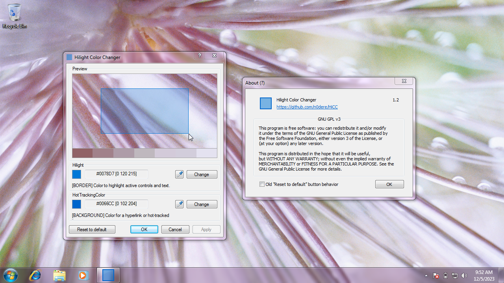

[](https://github.com/n0dere/HiCC/search?l=c)
[](https://www.microsoft.com/en-us/windows)
[](COPYING)

**Hilight Color Changer** (HiCC) is a utility that allows you to change the color of the selection rectangle on your desktop.

## Features
- Preview the results of changing the selection color without applying them to your desktop. You can see how your desktop will look with the new selection color before saving the changes.
- Choose a color from the palette that is automatically created based on your desktop wallpaper. Just click on any color in the palette and it will become the new selection color.
- Return to the default color settings at any time by clicking the "Reset to default" button.
- HiCC is licensed under the [GNU GPL v3](COPYING) (100% open source)

## Build
1. Clone the project repository, or download a zip archive with sources and unpack them.
```
git clone https://github.com/n0dere/HiCC
```
2. Select how to build the project:
<details> 
<summary align="center">MS Visual Studio Community (MSVC)</summary>

---

3. Open HiCC.sln using Visual Studio
4. Build by clicking on the "Build" menu and selecting "Build Solution." 
5. Open "(x64/)Release/HilightColorChanger_(x32/x64).exe" in the project directory

---

</details>
<details> 
<summary align="center">CMake (MSVC/MINGW) </summary>

---

3. Open the console in the project folder.
4. Enter this into the console:
```
cmake . -Bbuild -DCMAKE_BUILD_TYPE=Release
cmake --build ./build
```
5. Open "HilightColorChanger_(x32/x64).exe" in the build directory

---

</details>

## Compatibility
| OS            | Works?             | Note                   |
|---------------|:------------------:|------------------------|
| Windows 11    | :heavy_check_mark: | 10.0.22621.2428 (22H2) |
| Windows 10    | :heavy_check_mark: | 10.0.19044.1826 (21H2) |
| Windows 8.1   | :grey_question:    | Not tested             |
| Windows 8     | :grey_question:    | Not tested             |
| Windows 7     | :heavy_check_mark: | 6.1.7601               |
| Windows Vista | :grey_question:    | Not tested             |
| Windows XP    | :x:                | Just not supported     |

---

